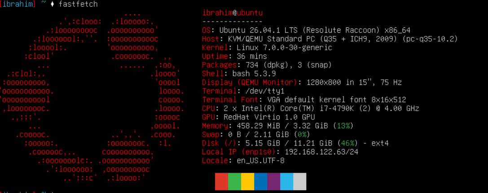

# Week 36 OCI Cloud Security Lab
## 1. Linux-Vm
Namn: ubuntu



---

## 2. Inlogging VM

| Inloggad | Servers namn | Operativsystem     | Uptime   |
|----------|--------------|--------------------|----------|
| ibrahim  | ubuntu       | ubuntu 26.04.1 LTS | 1h 19min |


## 3. Linux-kommandon

| Kommando       | Vad visar det?                                                              | CIA-koppling                                                                                                                                                                                                                                                      |
|----------------|-----------------------------------------------------------------------------|-------------------------------------------------------------------------------------------------------------------------------------------------------------------------------------------------------------------------------------------------------------------|
| whoami         | användarens namn                                                            | Konfidentialetet, rätt person ska ha åtkomst till saker till vad arbetet krävs                                                                                                                                                                                    |
| hostname       | Namnet till vad datorn heter men kan använd vara namnet på domainet         | Hostname kan avslöja vad datorn funktion är för. Därför att kan det vara lättare att filtera vilket måltavla är mest värd att attackera. Därmed riskera integritet av systemet.                                                                                   |
| pwd            | Visar nuvarande katalot. Var du är i fillsystemet                           | Denna kommand kan vissa en del av fillstrukturen och avslölja namn på filer som andra borde inte veta om. Vilket innebär konfidentialetet påverkas i denna instans                                                                                                |
| uname -a       | Visar systemet information. Vilket kernel som används                       | Visar systemet information som andra borde inte veta om. Denna information avslöjar version och därmed kan veta vilka sårbarheter kan användas för det systemet. Alltså får till information som är inte behörig till, konfidentialet.                            |
| uptime         | Visar hur länge datorn har varit igång                                      | Visar hur länge datorn har varit tillgänglig.                                                                                                                                                                                                                     |
| ls -la         | Visar alla katolog och filer                                                | Visar filstrukturen och namnet på filerna. Konfidentialetet riskeras när obehörig ser.                                                                                                                                                                            |
| date           | Visar idagens datum                                                         | Kommando kan visa vilken tidzone man är på och därmed avslöja var man är världen. Med tillräckling hög privelige kan även ändras systemet datum och tid, vilket innebär det kan finnas potentiell fell sparade av tid i logfiler och därmed påverkas intergritet. |
| id             | Visar användar gruppar                                                      | Visar information om användare och group. Det ger en bild på hur systemet är uppbyggd och potentiell visar måltavla och hur man kommer in i systemet. Konfidentialet                                                                                              |
| groups         | Visar bara grupp                                                            | Visar villka gruppar finns i systemet. Kan påverka konfidentialetet.                                                                                                                                                                                              |
| ps aux \| head | Visar alla processer i systmet och även vilken användare som kör processen. | Konfidentialetet. Det finns mycket information om systemet. Vem, vad och när körs processen.                                                                                                                                                                      |

---
## 4. Hardening

### Kontroll 1 

```bash
$ whoami
ibrahim
```
Användare `ibrahim` används i detta system.

```bash
$ id
uid=1000(ibrahim) gid=1000(ibrahim) groups=1000(ibrahim),4(adm),24(cdrom),27(sudo),30(dip),46(plugdev),100(users),101(lxd)
```

```bash
$ groups
ibrahim adm cdrom sudo dip plugdev users lxd
```

Användare `ibrahim` tillhör i åtta grupper.

Varför ska administrativa rättigheter användas försiktigt?

Admin rättigheter ska användas försiktighet eftersom admin har full kontroll över systemet. Med dessa rättigheter kan man göra permanenta ändringar som kan skada systemet eller gör systemet urfunktion.

### Kontroll 2

```bash
$ ls -l
-rw-rw-r-- 1 ibrahim ibrahim 0 Sep 11 16:53 text.txt
```
Alla användare kan läsa filen. Bara nuvarande och de som ingår i gruppen kan skriva filen.

```bash
$ chmod 600 text.txt
$ ls -l
-rw------- 1 ibrahim ibrahim 0 Sep 11 16:53 text.txt
```
Endast användare `ibrahim` kan läsa och skriva filen.

### Kontroll 3

```bash
$ sudo apt update
88 packages can be upgraded. Run 'apt list --upgradable' to see them
```
**Varför är uppdateringar viktiga?**

Uppdateringen kan ingå säkerhetspatcher som fixar sårbarheter, buggar och systemet hålls stabilare längre. 

**Vilken del av CIA påverkas?**

Uppdateringen kan fixa sårbarheter och därmed minska risken av obehörig intrång. (Konfidentialitet).
Systemet blir mer stabilt eftersom updateringar brukar fixa buggar som orsakar krachar i applikationer. Mindre krash och användare fortsätta använda applikationen. (Tillgänglighet).

---
## 5. Recovery-plan
### Vad kan gå fel?
### Hur upptäcker jag problemet?
### Vad kontrollerar jag först?
### Hur återställer jag åtkomst?
### När behöver jag hjälp?
---
## 6. Backup
### Vad har jag sparat?
### Vad finns i GitHub?
### Vad kan återskapas?
### Vad går inte att återskapa?
---
## 7. Cleanup
### VM-instans
### Diskar
### Backuper
### Publika IP-adresser
### GitHub-evidens
---
## 8. CIA-reflektion
### Konfidentialitet
### Integritet
### Tillgänglighet
---
## 9. Reflektion
### Vad fungerade bra?
### Vad var svårt?
### Vad lärde jag mig?

