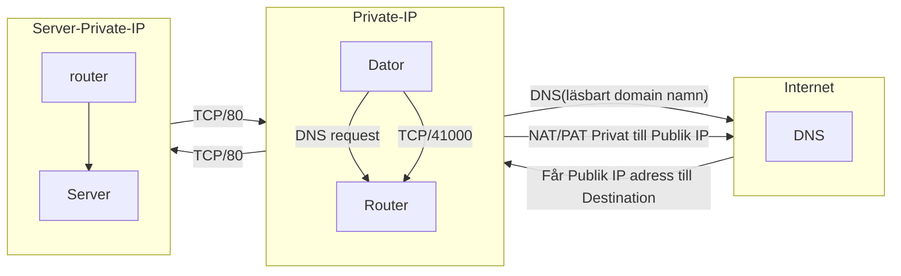

### Del A: miljö och metod
Lokal linux - Arch linux

Interface är enp3s0 på min dator men pcap filen är inte fångad av detta inteface utan pcap filen är från läraren.

Reservspår användes.

Beskriv hur pcap och skärmbilder har hanterats och sanerats?
Inga skärmbilder användes och pcap filen är inte uppladdat till github.
Publik IP uppkommer i pcap filen och varje gång den publika IP-adressen nämns i denna dokument har den ändras till domain namn istället

### Del B: paketets väg

**Observerat i pcap:**

Lokalt IP-adress: 192.0.2.10
DNS IP-adress: 192.0.2.53

| Paket | Observation                                                                                                                             | Var I Wireshark hittades                                                                                      |
|-------|------------------------------------------------------------------------------------------------------------------------------------------|------------------------------------------------------------------------------------------------------------------------------------------------------------------------------|
| 1     | DNS förfråga från källa 192.0.2.10 -> 192.0.2.53 (training.example)                                                                     | IP-adressen hittades i Source och Destination kolumn, DNS i protokoll kolumn och domain namnet i info kolumn |
| 2     | DNS svarar och med training.example public IP-adress                                                                                    | Info kolumn eller under Internet Protokoll                                                                    |
| 9     | 192.0.2.10 initiarar TCP handskakning med training.example i port 41000 -> 80                                                           | Info                                                                                                          |
| 10    | training.example svarar tillbaka med (SYN, ACK)                                                                                         | Info                                                                                                          |
| 11    | 192.0.2.10 svarar med (ACK) och handskakningen är framgångsrik                                                                          | Info                                                                                                          |
| 12    | 192.0.2.10 begär en html sidan med GET method till training.example. HTTP protokoll används                                         | Protokoll och Info kolumn                                                                                     |
| 13    | training.example svarar med (ACK)                                                                                                       | Info                                                                                                          |
| 14    | training.example svarar med att skicka html sida (text/plain), HTTP protokoll används                                                   | Info                                                                                                          |
| 15    | 192.0.2.10 svarad med (ACK)                                                                                                             | Info                                                                                                          |
| 16    | 192.0.2.10 skickar (FIN, ACK), det är början av TCP handskakning om att denna kommunikation är färdig och inget mer data kommer skickas | Info                                                                                                          |
| 17    | training.exampel skickas tillbaka (FIN, ACK)                                                                                            | Info                                                                                                          |
| 18    | 192.0.2.10 skickar (ACK), därmed slut med tre handskakning och kommunikationen stängs ner                                | Info                                                                                                          |

**Nätverkstekniska förklaring:**

En dator har MAC-adress och IP-adress. IP-adressen är tilldelad av routern. Enheter som är kopplat till routern är privat nätverk. Både MAC-adressen och IP-adressen används för veta
vem och var informationen ska skickas. Varje enhet har portar och dessa portar används till att koppla till nätverket och kategorisera rätt sort av information kommer in, alltså protokoll. Applikationsprotokollet är en bestämmelse om hur kommunikationen ska göras mellan mjukvaran. Transportprotokollet är en bestämmelse för kommunikation mellan enheter. Dess jobb är att transportera information säkert och att informationen inte har ändrats. Oftast delas informationen till standardstorlek och monteras tillbaka vid destination. Paket färdas från dator till routern. Routern är gateway mellan privat och publik IP-adress. Routern har NAT som översätter den privata IP-adressen till en publik IP-adress som alla i privata nätverk delar. PAT är den delen vet vilken port datorn har skickats från och vilket port ska användas till att skicka till den publika nätverket. Paket färdas vidare till DNS där människor läsbart domännamn byts till destinationens publik IP-adress. Paket färdats till destinationens router och beslut om paket ska släppas till rätt port. Om brandväggen har stängt porten så kan inte paket färdas vidare men om porten är öppen då kan paket färdas vidare genom att sätta server MAC-adress och IP-adress på paket som header.

### Del C: protokollinventering

| Protokoll | Minsta evidens                                                                                               | Analysfråga                                                                                                                                                                                                       |
|-----------|--------------------------------------------------------------------------------------------------------------|-------------------------------------------------------------------------------------------------------------------------------------------------------------------------------------------------------------------|
| DNS       | Packet 1 och Packet 33 DNS query, `training.example` och `missing.training.example`                          | Packet 1 svarar tillbaka med publik IP-adress till domain namnet medan paket 33 misslyckas och svarar med att `missing.training.example` inte finns.                                                              |
| ICMP      | Packet 3 till 8 pingar `training.example`, matchar med publik IP-adress                                      | Det visar att det går att nå destination men detta visar inget om tjänsten fungerar som det ska.                                                                                                                  |
| TCP       | Packet 9 till 11 gjorde fullkomlig handskakning. Packet 19 till 21 gjordes ochså en handskakning             | SYN, SYN, ACK, ACK kan synas i info kolumen. Packet 16 till 18 genomfördes avlustnings handskakning, Packet 30 till 32 genomfördes avlustnings handskakning. Port 80 och 443 användes på dessa två TCP anslutning |
| HTTP      | Packet 12 och 14 användes http och begärde en html sida och fick repons.                                     | Header kunde läsas under Hypertext Transfer Protocol. Använderens information `User-Agent` kunde hittas. HTTP repons gav plain text och kunde se innehållet under Line-based text data.                           |
| TLS/HTTPS | Packet 22, 24, 26 och 28 var TLSv1.2 protokoll. `Cleint Hello`, `Application Data`, `Server Hello` hittades. | Port 443. Innehållet är krypterat och header kan inte heller hittas.                                                                                                                                              |

### Del D: fördjupad analys av två flöden
Välj två olika flöden, varav minst ett ska vara TCP-baserat. För varje flöde ska du redovisa:
**Paketnummer eller tydlig flödeshänvisning**

Packet 9 till 11 är handskakning. Packet 12 till 15 är begäran av websida, ger websida och repons.
**Källa, destination, port och protokoll**
`192.0.2.x` --> `training.example`
Port 41000 --> 80
TCP

**Händelseordning**
Handskakning --> request --> ACK --> serves --> ACK

**Förväntat beteende**
Ovanför händelseordning är förväntat beteende.

**Faktisk observation**
Handskakning --> request --> ACK --> serves --> ACK

**Eventuell avvikelse, timeout, reset eller retransmission**
Ingen avvikelse kunde inte hittas förutom packet 33 till 34 får en misslyckande DNS query.

### Del E: krypterat och okrypterat

| Aspekt                  | HTTP                                                           | TLS/HTTPS                                                                                                                                |
|-------------------------|----------------------------------------------------------------|------------------------------------------------------------------------------------------------------------------------------------------|
| Synlig metadata         | Request method, URI, Version, Host, User-Agent                 | Krypterat, kunde inte hitta header och innehållet                                                                                        |
| Läsbar applikationsdata | Kunde läsa både header och innehållet. Data kom i plain text   | Krypterat, Oläsbar karaktärer i wireshark rawformat.                                                                                     |
| Felsökningsvärde        |                                                                |                                                                                                                                          |
| Konfidentialitetrisk    | Innehållet av en websida och använder aktivetet kan exponseras | Porten fortfarande synlig. Domain är synlig (public IP-adress). Kan inte ses innehållet och svårt att säga vad användare görs i websidan |  |  |

### Del F: brandvägg och hardening
Välj ett observerat flöde och ange vilken inkommande eller utgående brandväggsregel som principiellt skulle
beröra det.
Paket 9 - 18 använder port 80. Alla trafik ska gå genom router och brandväggen sitter där oftas. Både klienten och server sida kan ha regel om paket ska komma in i privata nättet eller komma ut till offentliga nätet.

Förklara skillnaden mellan en tjänst som lyssnar lokalt och trafik som tillåts passera en brandvägg.
En server kan vara igång med en port betyder inte att den är nåbar om brandväggen blockerar trafiken. Om det inte fanns några öppna portar och brandväggen släpper fram trafiken då skulle det inte finnas något direkt risk. Men i framtiden skulle porten öppnas på grund av att ha lokalt server eller en test med porten och tanken var aldrig att ha anslutning med världen. Då finns det en risk.

Resonera om default deny och minsta nödvändiga öppning.
Default deny innebär att alla portar blockeras och minsta nödvändiga öppning är öppna endast portar som används. Detta minska ytan för potentiellt attack.

Koppla analysen till föregående veckors hardening: är de observerade tjänsterna och flödena rimliga för
miljön?

Observationen som gjordes i wireshark verkar vara rimlig. Ingen okänt port användes. Däremot kan port 80 vara problematisk. Istället att använda http som är okrypterad, använd https som uppnår samma mål som http fast det är krypterad. Därför kanske port 80 borde blockeras.

### Del G: CIA och evidens

| Område           | Besvara                                                                                          |
|------------------|--------------------------------------------------------------------------------------------------|
| Konfidentialitet | IP-adress, http header och innehållet behöver skyddas.                                           |
| Integritet       | Shasum -a 256 filen och jämför med lärarens hash om det finns för att veta om filen har ändrats. |
| Tillgänglighet   | Paket 33 till 34 visar domainnamnet inte fanns                                                   |
| Evidenskvalitet  | Reservspårens användes och variantioner av trafik finns inte.                                    |

### Del H: slutsats och rekommendation
**Skriv en sammanhängande slutsats som besvarar:**

**Vad hände i den analyserade trafiken?**

DNS-uppslag, lyckad HTTP-session, lyckad TLS-session, ett misslyckat DNS-uppslag, pings.

**Vilka observationer är starkast underbyggda?**

Observationen visar publik ip adressen till servern. Visar vilka portar användes. Visade även hur HTTP kundes läsa i klar text. Verifierade att TLS var krypterat.

**Vilken säkerhets- eller driftåtgärd rekommenderar du, utan att överdriva vad pcapen visar?**

Rekommenation är att använda https istället för http om det går.

**Vilken ytterligare evidens skulle du samla in i nästa steg?**

Jag skulle fånga min egen fångst och i längre tid för att få bättre uppfattning på hur min trafiken ser ut.
### AI-användning
Jag använde AI till att bättre förstå hur OSI-model och TCP-model. Diagramet gjordes själv och AI dubble kollade om jag hade gjord rätt.
